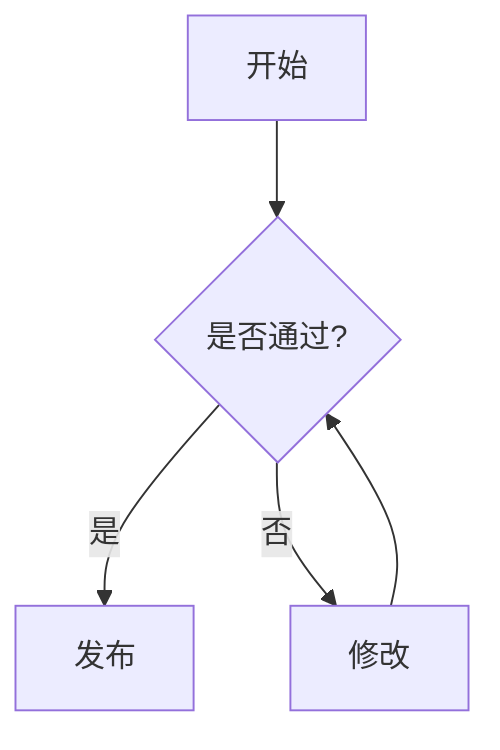
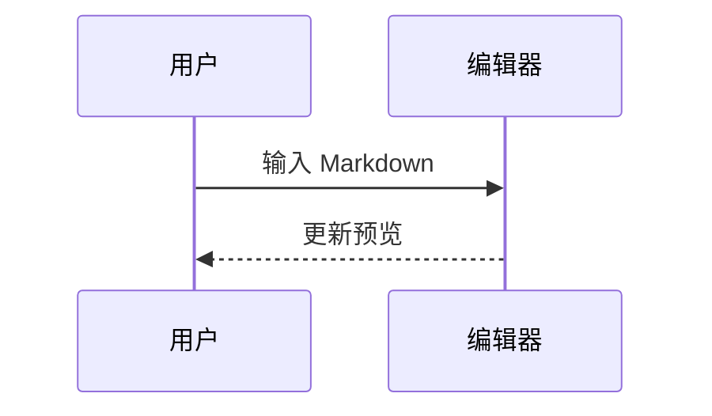

# Mason Markdown 全语法测试文档

这是一份用于测试 Mason Markdown `bytemd-v1` 兼容配置的综合文档。正常语法应正确渲染；文末的安全边界和异常语法用于确认编辑器能够安全、稳定地降级。

## 1. 基础 Markdown

### 标题层级

# 一级标题
## 二级标题
### 三级标题
#### 四级标题
##### 五级标题
###### 六级标题

这是第一段。这里包含 **粗体**、*斜体*、***粗斜体***、~~删除线~~、`行内代码`，以及一个[普通链接](https://example.com)。

这里是同一段中的软换行
下一行仍属于同一段。

反斜杠转义：\*不是斜体\*，\`不是代码\`，\# 不是标题。

---

### 引用

> 这是一级引用。
>
> > 这是嵌套引用，包含 **格式化文本**。
>
> 引用结束。

### 列表

- 无序列表项目一
- 无序列表项目二
  - 嵌套项目二点一
  - 嵌套项目二点二
    - 更深一层

1. 有序列表项目一
2. 有序列表项目二
   1. 嵌套有序项目
   2. 另一个嵌套项目
3. 有序列表项目三

### 任务列表

- [x] 已完成的任务
- [ ] 未完成的任务
- [X] 大写 X 任务

## 2. GFM 扩展

### 自动链接

网址：https://example.com/docs/path?a=1&b=2

邮箱：test@example.com

显式自动链接：<https://github.com/> 和 <mailto:test@example.com>

### 脚注

这句话有一个脚注[^first]，这句话有第二个脚注[^second]。

[^first]: 第一个脚注内容，包含 **粗体** 和 `代码`。
[^second]: 第二个脚注内容，包含一个 [链接](https://example.com)。

### GFM 表格

| 左对齐 | 居中对齐 | 右对齐 |
| :--- | :---: | ---: |
| **粗体** | *斜体* | `code` |
| [链接](https://example.com) | $x^2$ | ✅ |
| 中文内容 | mixed width | 123.45 |

### 图片


图片插入功能还应单独测试：使用工具栏的图片按钮，分别验证远程地址、本地上传和 Halo 附件选择。

## 3. 数学公式

行内公式：$E=mc^2$，$\sum_{i=1}^{n} i=\frac{n(n+1)}{2}$，以及表格中的 $a^2+b^2=c^2$。

块级公式：

$$
\int_0^1 x^2\,dx=\frac{1}{3}
$$

$$
\begin{aligned}
f(x) &= x^2 + 2x + 1 \\
     &= (x+1)^2
\end{aligned}
$$

公式与普通文本混排：当 $n\to\infty$ 时，$\lim_{n\to\infty}(1+\frac{1}{n})^n=e$。

公式在引用中：

> 勾股定理可以写成 $a^2+b^2=c^2$。

公式在列表中：

1. 一次项：$ax$
2. 二次项：$bx^2$
3. 常数项：$c$

## 4. Mason Markdown Callout 指令

:::info[信息提示]
这是 info 类型提示。内容支持 **粗体**、*斜体*、`行内代码`、列表和公式 $x+1$。

- 第一项
- 第二项
:::

:::success[成功提示]{open}
这是默认展开的 success 提示。
:::

:::warning[警告提示]
这是默认折叠的 warning 提示。点击标题检查展开和收起行为。
:::

:::error[错误提示]{open}
这是默认展开的 error 提示。
:::

### Callout 中的复杂内容

:::info[带表格的提示]{open}
| 项目 | 状态 |
| --- | --- |
| GFM 表格 | 支持 |
| 数学公式 | $x^2$ |
:::

## 5. Mason Markdown 对齐和题记

:::align{left}
左对齐段落。
:::

:::align{center}
居中段落，检查文本是否真正位于容器中间。
:::

:::align{right}
右对齐段落。
:::

:::epigraph[-- 测试作者]
这是题记内容。题记中也可以包含 **格式化文本** 和 $数学公式$。
:::

## 6. 嵌套指令

::::warning[外层警告]
这是外层内容。

:::info[内层信息]{open}
这是内层内容，检查 details/summary 的嵌套、键盘操作和展开状态。
:::

外层内容继续。
::::

## 7. Cute Table

### Three 样式

::cute-table{three}

| 名称 | 数值 | 备注 |
| --- | ---: | :--- |
| Alpha | 1 | 普通单元格 |
| Beta | 2 | **格式化** |

### Tuack 样式

::cute-table{tuack}

| A | B | C |
| --- | --- | --- |
| 1 | 2 | 3 |

### Tuack 指定边界列

::cute-table{tuack=2}

| 第一列 | 第二列 | 第三列 | 第四列 |
| --- | --- | --- | --- |
| 左边界 | 边界列 | 内容 | 内容 |
| 1 | 2 | 3 | 4 |

## 8. Mason Markdown 合并表格

下面的 `^` 表示向上合并，`<` 表示向左合并。`>` 不是 Mason Markdown 文档定义的正常合并语法，异常表格只能局部降级为普通单元格，不能让整张表失效。检查预览、保存、刷新、重新编辑后表格拓扑是否保持不变。

| A | B | C | D |
| --- | --- | --- | --- |
| 横向合并起点 | < | < | 普通单元格 |
| 独立单元格 | 独立单元格 | 独立单元格 | 第二行 |

| A | B | C |
| --- | --- | --- |
| 纵向合并 | 独立单元格 | 普通单元格 |
| ^ | 独立单元格 | 第二行 |
| ^ | 普通文本 | 第三行 |

### 合并单元格中的富文本

| 标题 | 内容 | 数学 |
| --- | --- | --- |
| 主单元格 | **粗体**、[链接](https://example.com) | $a+b$ |
| ^ | 继续内容 | `code` |

### 看起来像标记但不应合并的内容

| 普通文本 | 普通文本 |
| --- | --- |
| \^ | `\|` |
| greater than > | less than < |

## 9. 代码块和语法高亮

没有标注语言的代码块应按 C++ 处理：

```
#include <iostream>
int main() {
  std::cout << "default C++" << std::endl;
  return 0;
}
```

### C++ 与行号高亮

~~~cpp lines=2-3,5
#include <iostream>
int main() {
  int answer = 42;
  std::cout << answer << std::endl;
  return 0;
}
~~~

### C

```c
#include <stdio.h>

int main(void) {
  printf("hello c\\n");
  return 0;
}
```

### Python

```python lines=2
def greet(name):
    message = f"Hello, {name}!"
    return message

print(greet("Markdown"))
```

### Java

```java
public class Main {
  public static void main(String[] args) {
    System.out.println("Hello Java");
  }
}
```

### JavaScript

```javascript
const values = [1, 2, 3];
const doubled = values.map((value) => value * 2);
console.log(doubled);
```

### Markdown 代码

```markdown
## This is source

**bold** and `inline code`
```

### LaTeX 代码

```latex
\documentclass{article}
\begin{document}
  $E=mc^2$
\end{document}
```

### 纯文本代码

```plaintext
This block must not receive token colors.
<not-an-html-tag>
```

### Mermaid





### 超长代码行换行

```cpp
std::string longText = "This is a deliberately long source line used to verify that code wraps inside the preview without creating a horizontal scrollbar or moving the line numbers.";
```

### 代码元数据边界

```cpp lines=1,3-4,99
int first = 1;
int second = 2;
int third = 3;
int fourth = 4;
```

## 10. 混合嵌套场景

:::info[综合测试]{open}
1. 列表里有公式 $x^2$。
2. 列表里有 `inline code`。
3. 列表里有 [链接](https://example.com)。

| 类型 | 示例 |
| --- | --- |
| 代码 | `return 0;` |
| 数学 | $\alpha+\beta$ |
| 删除线 | ~~旧内容~~ |
:::

> 引用中的列表：
>
> - **重点**
> - [链接](https://example.com)
> - $a^2$

## 11. Unicode 和长文本

中文、English、日本語、한국어、Русский、emoji ✅ 🚀 数学 $\pi$ 混排。

| 中文 | emoji | 混合宽度长文本 |
| --- | --- | --- |
| 测试 | ✅ | 这是一个较长的混合宽度内容，用于检查表格和编辑区的布局。 |

## 12. 安全过滤与异常降级

下面的危险内容不应执行脚本，也不应产生可利用的链接：

<script>alert('this must be removed')</script>

[危险链接](javascript:alert('this must be blocked'))

```unknown-language
Unknown language should render as readable plain text and report a diagnostic.
```

```cpp lines=0,4-2
int invalidRange = 1;
```

下面这个未知指令应安全降级为可读文本，不应被解释成任意 HTML：

:::unknown-directive[不应被执行]
原样内容
:::

## 13. 交互验收清单

- [ ] 编辑器左侧行号与代码内容对齐，缩放和换行后不漂移。
- [ ] 当前行高亮不覆盖行号分隔线，文本全选只覆盖文本区域。
- [ ] 亮色和暗色模式下编辑区、预览区、代码块、公式和 Mermaid 配色协调。
- [ ] 表格插入默认是 1 行 1 列，换行不会自动增加表格行。
- [ ] 表格合并、拆分、保存、刷新、重新编辑后结构不变。
- [ ] 工具栏的公式、Mermaid、表格、图片和链接按钮能够打开对应操作。
- [ ] 保存、自动保存、刷新恢复和发布都不会丢失 raw Markdown。
- [ ] 发布后文章页面的公式、代码高亮、Mermaid、表格样式正常。
